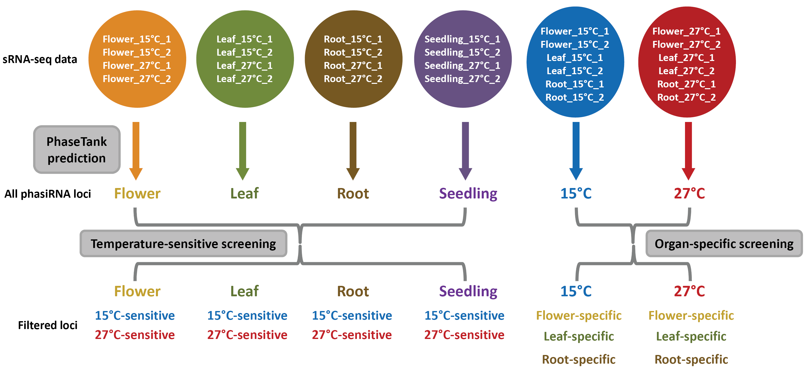

# PhasiRNAs in *Arabidopsis*: biogenesis, temperature sensitivity and organ specificity

**Workflow for identification of the phasiRNA loci**

## All *PHAS* loci
|   | Flower | Leaf | Root | Seedling | 15℃ | 27℃ |
|:------:|:------:|:------:|:------:|:------:|:------:|:------:|
| 21 nt | [Seq](phase_loci/Loci%20seq_flower-21nt.txt) | [Seq](phase_loci/Loci%20seq_leaf-21nt.txt) | [Seq](phase_loci/Loci%20seq_root-21nt.txt) | [Seq](phase_loci/Loci%20seq_seedling-21nt.txt) | [Seq](phase_loci/Loci%20seq_15℃-21nt.txt) | [Seq](phase_loci/Loci%20seq_27℃-21nt.txt) |
| 22 nt | [Seq](phase_loci/Loci%20seq_flower-22nt.txt) | [Seq](phase_loci/Loci%20seq_leaf-22nt.txt) | [Seq](phase_loci/Loci%20seq_root-22nt.txt) | [Seq](phase_loci/Loci%20seq_seedling-22nt.txt) | [Seq](phase_loci/Loci%20seq_15℃-22nt.txt) | [Seq](phase_loci/Loci%20seq_27℃-22nt.txt) |
| 23 nt | [Seq](phase_loci/Loci%20seq_flower-23nt.txt) | [Seq](phase_loci/Loci%20seq_leaf-23nt.txt) | [Seq](phase_loci/Loci%20seq_root-23nt.txt) | [Seq](phase_loci/Loci%20seq_seedling-23nt.txt) | [Seq](phase_loci/Loci%20seq_15℃-23nt.txt) | [Seq](phase_loci/Loci%20seq_27℃-23nt.txt) |
| 24 nt | [Seq](phase_loci/Loci%20seq_flower-24nt.txt) | [Seq](phase_loci/Loci%20seq_leaf-24nt.txt) | [Seq](phase_loci/Loci%20seq_root-24nt.txt) | [Seq](phase_loci/Loci%20seq_seedling-24nt.txt) | [Seq](phase_loci/Loci%20seq_15℃-24nt.txt) | [Seq](phase_loci/Loci%20seq_27℃-24nt.txt) |

## All PhasiRNAs
(In the expression data files, the phasiRNAs assigned to the loci passed "3-fold" screening are marked by blue colour.)

|   | Flower | Leaf | Root | Seedling | 15℃ | 27℃ |
|:------:|:------:|:------:|:------:|:------:|:------:|:------:|
| 21 nt | [Seq](phasiRNA_seq/PhasiRNA%20seq_flower-21nt.txt), [Exp](phasiRNA_expr/PhasiRNA_exp_flower_21nt.xls) | [Seq](phasiRNA_seq/PhasiRNA%20seq_leaf-21nt.txt), [Exp](phasiRNA_expr/PhasiRNA_exp_leaf_21nt.xls) | [Seq](phasiRNA_seq/PhasiRNA%20seq_root-21nt.txt), [Exp](phasiRNA_expr/PhasiRNA_exp_root_21nt.xls) | [Seq](phasiRNA_seq/PhasiRNA%20seq_seedling-21nt.txt), [Exp](phasiRNA_expr/PhasiRNA_exp_seedling_21nt.xls) | [Seq](phasiRNA_seq/PhasiRNA%20seq_15℃-21nt.txt), [Exp](phasiRNA_expr/PhasiRNA_exp_15℃_21nt.xls) | [Seq](phasiRNA_seq/PhasiRNA%20seq_27℃-21nt.txt), [Exp](phasiRNA_expr/PhasiRNA_exp_27℃_21nt.xls) |
| 22 nt | [Seq](phasiRNA_seq/PhasiRNA%20seq_flower-22nt.txt), [Exp](phasiRNA_expr/PhasiRNA_exp_flower_22nt.xls) | [Seq](phasiRNA_seq/PhasiRNA%20seq_leaf-22nt.txt), [Exp](phasiRNA_expr/PhasiRNA_exp_leaf_22nt.xls) | [Seq](phasiRNA_seq/PhasiRNA%20seq_root-22nt.txt), [Exp](phasiRNA_expr/PhasiRNA_exp_root_22nt.xls) | [Seq](phasiRNA_seq/PhasiRNA%20seq_seedling-22nt.txt), [Exp](phasiRNA_expr/PhasiRNA_exp_seedling_22nt.xls) | [Seq](phasiRNA_seq/PhasiRNA%20seq_15℃-22nt.txt), [Exp](phasiRNA_expr/PhasiRNA_exp_15℃_22nt.xls) | [Seq](phasiRNA_seq/PhasiRNA%20seq_27℃-22nt.txt), [Exp](phasiRNA_expr/PhasiRNA_exp_27℃_22nt.xls) |
| 23 nt | [Seq](phasiRNA_seq/PhasiRNA%20seq_flower-23nt.txt), [Exp](phasiRNA_expr/PhasiRNA_exp_flower_23nt.xls) | [Seq](phasiRNA_seq/PhasiRNA%20seq_leaf-23nt.txt), [Exp](phasiRNA_expr/PhasiRNA_exp_leaf_23nt.xls) | [Seq](phasiRNA_seq/PhasiRNA%20seq_root-23nt.txt), [Exp](phasiRNA_expr/PhasiRNA_exp_root_23nt.xls) | [Seq](phasiRNA_seq/PhasiRNA%20seq_seedling-23nt.txt), [Exp](phasiRNA_expr/PhasiRNA_exp_seedling_23nt.xls) | [Seq](phasiRNA_seq/PhasiRNA%20seq_15℃-23nt.txt), [Exp](phasiRNA_expr/PhasiRNA_exp_15℃_23nt.xls) | [Seq](phasiRNA_seq/PhasiRNA%20seq_27℃-23nt.txt), [Exp](phasiRNA_expr/PhasiRNA_exp_27℃_23nt.xls) |
| 24 nt | [Seq](phasiRNA_seq/PhasiRNA%20seq_flower-24nt.txt), [Exp](phasiRNA_expr/PhasiRNA_exp_flower_24nt.xls) | [Seq](phasiRNA_seq/PhasiRNA%20seq_leaf-24nt.txt), [Exp](phasiRNA_expr/PhasiRNA_exp_leaf_24nt.xls) | [Seq](phasiRNA_seq/PhasiRNA%20seq_root-24nt.txt), [Exp](phasiRNA_expr/PhasiRNA_exp_root_24nt.xls) | [Seq](phasiRNA_seq/PhasiRNA%20seq_seedling-24nt.txt), [Exp](phasiRNA_expr/PhasiRNA_exp_seedling_24nt.xls) | [Seq](phasiRNA_seq/PhasiRNA%20seq_15℃-24nt.txt), [Exp](phasiRNA_expr/PhasiRNA_exp_15℃_24nt.xls) | [Seq](phasiRNA_seq/PhasiRNA%20seq_27℃-24nt.txt), [Exp](phasiRNA_expr/PhasiRNA_exp_27℃_24nt.xls) |
 

## [List of phasiRNAs enriched in AGO1 or AGO4 in different tissues](/Table%20S3%20List%20of%20phasiRNAs%20enriched%20in%20AGO1%20or%20AGO4%20in%20different%20tissues.xls)

## List of temperature-sensitive/organ-specific phasiRNA loci
1. Locus IDs: [15℃-sensitive phasiRNA loci identified in flowers](list_of_specific_loci/15℃-sensitive%20phasiRNA%20loci%20identified%20in%20flowers.txt)
2. Locus IDs: [15℃-sensitive phasiRNA loci identified in leaves](list_of_specific_loci/15℃-sensitive%20phasiRNA%20loci%20identified%20in%20leaves.txt)
3. Locus IDs: [15℃-sensitive phasiRNA loci identified in roots](list_of_specific_loci/15℃-sensitive%20phasiRNA%20loci%20identified%20in%20roots.txt)
4. Locus IDs: [15℃-sensitive phasiRNA loci identified in seedlings](list_of_specific_loci/15℃-sensitive%20phasiRNA%20loci%20identified%20in%20seedlings.txt)
5. Locus IDs: [27℃-sensitive phasiRNA loci identified in flowers](list_of_specific_loci/27℃-sensitive%20phasiRNA%20loci%20identified%20in%20flowers.txt)
6. Locus IDs: [27℃-sensitive phasiRNA loci identified in leaves](list_of_specific_loci/27℃-sensitive%20phasiRNA%20loci%20identified%20in%20leaves.txt)
7. Locus IDs: [27℃-sensitive phasiRNA loci identified in roots](list_of_specific_loci/27℃-sensitive%20phasiRNA%20loci%20identified%20in%20roots.txt)
8. Locus IDs: [27℃-sensitive phasiRNA loci identified in seedlings](list_of_specific_loci/27℃-sensitive%20phasiRNA%20loci%20identified%20in%20seedlings.txt)
9. Locus IDs: [Flower-specific phasiRNA loci identified at 15℃](list_of_specific_loci/Flower-specific%20phasiRNA%20loci%20identified%20at%2015℃.txt)
10. Locus IDs: [Leaf-specific phasiRNA loci identified at 15℃](list_of_specific_loci/Leaf-specific%20phasiRNA%20loci%20identified%20at%2015℃.txt)
11. Locus IDs: [Flower-specific phasiRNA loci identified at 27℃](list_of_specific_loci/Flower-specific%20phasiRNA%20loci%20identified%20at%2027℃.txt)

## List of temperature-sensitive/organ-specific phasiRNAs
1. PhasiRNA IDs: [15℃-sensitive phasiRNAs identified in flowers](list_of_specific_phasiRNA/15℃-sensitive%20phasiRNAs%20identified%20in%20flowers.txt)
2. PhasiRNA IDs: [15℃-sensitive phasiRNAs identified in leaves](list_of_specific_phasiRNA/15℃-sensitive%20phasiRNAs%20identified%20in%20leaves.txt)
3. PhasiRNA IDs: [15℃-sensitive phasiRNAs identified in roots](list_of_specific_phasiRNA/15℃-sensitive%20phasiRNAs%20identified%20in%20roots.txt)
4. PhasiRNA IDs: [15℃-sensitive phasiRNAs identified in seedlings](list_of_specific_phasiRNA/15℃-sensitive%20phasiRNAs%20identified%20in%20seedlings.txt)
5. PhasiRNA IDs: [27℃-sensitive phasiRNAs identified in flowers](list_of_specific_phasiRNA/27℃-sensitive%20phasiRNAs%20identified%20in%20flowers.txt)
6. PhasiRNA IDs: [27℃-sensitive phasiRNAs identified in leaves](list_of_specific_phasiRNA/27℃-sensitive%20phasiRNAs%20identified%20in%20leaves.txt)
7. PhasiRNA IDs: [27℃-sensitive phasiRNAs identified in roots](list_of_specific_phasiRNA/27℃-sensitive%20phasiRNAs%20identified%20in%20roots.txt)
8. PhasiRNA IDs: [27℃-sensitive phasiRNAs identified in seedlings](list_of_specific_phasiRNA/27℃-sensitive%20phasiRNAs%20identified%20in%20seedlings.txt)
9. PhasiRNA IDs: [Flower-specific phasiRNAs identified at 15℃](list_of_specific_phasiRNA/Flower-specific%20phasiRNAs%20identified%20at%2015℃.txt)
10. PhasiRNA IDs: [Leaf-specific phasiRNAs identified at 15℃](list_of_specific_phasiRNA/Leaf-specific%20phasiRNAs%20identified%20at%2015℃.txt)
11. PhasiRNA IDs: [Flower-specific phasiRNAs identified at 27℃](list_of_specific_phasiRNA/Flower-specific%20phasiRNAs%20identified%20at%2027℃.txt)

## [RDR/DCL-dependent phasiRNA loci identified in flowers](/Table%20S4%20RDR-%20or%20DCL-dependent%20phasiRNA%20loci%20identified%20in%20flowers.xls)

## [List of *TAS* loci and their temperature sensitivity and organ specificity](/Table%20S5%20List%20of%20TAS%20loci%20and%20their%20temperature%20sensitivity%20and%20organ%20specificity.xls)

## [List of targets regulated by the tasiRNA candidates](Table%20S6%20List%20of%20targets%20regulated%20by%20the%20tasiRNA%20candidates.pdf)

## [T-plots showing the degradome-validated targets of the *TAS* candidate](/Figure%20S5%20Target%20plots%20showing%20the%20degradome-validated%20targets%20of%20the%20tasiRNAs%20encoded%20by%20a%20TAS%20candidate.pdf)

## [Supplementary figures](/Figure%20S1%20S2%20S3%20S4%20S6%20S7%20S8%20and%20S9.pdf)

